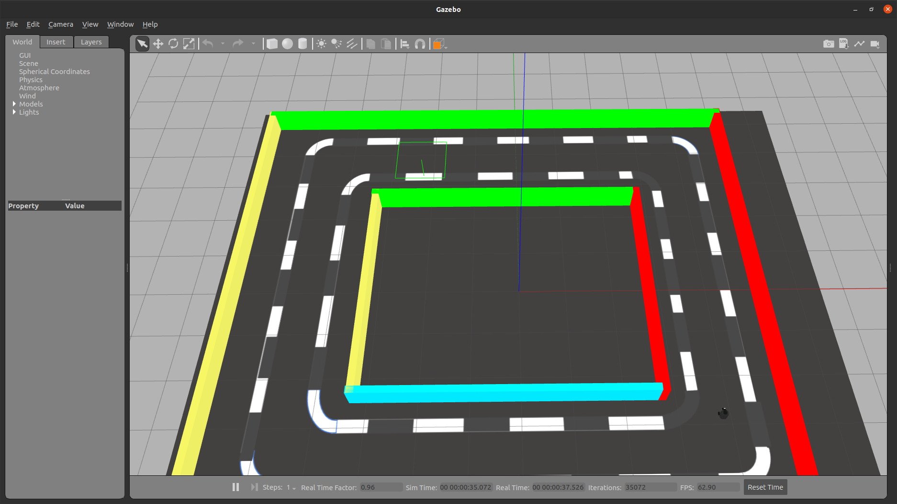
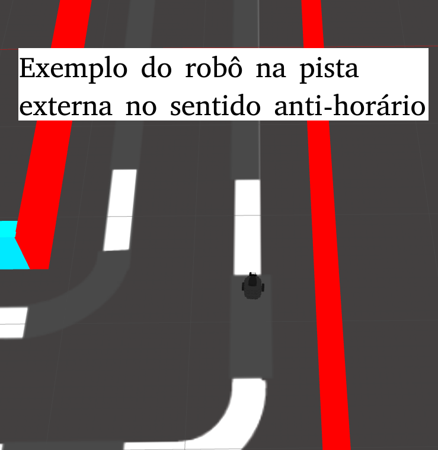
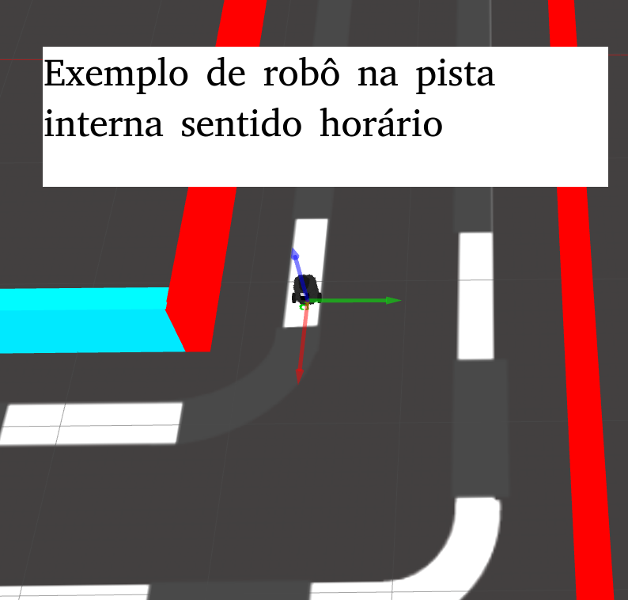
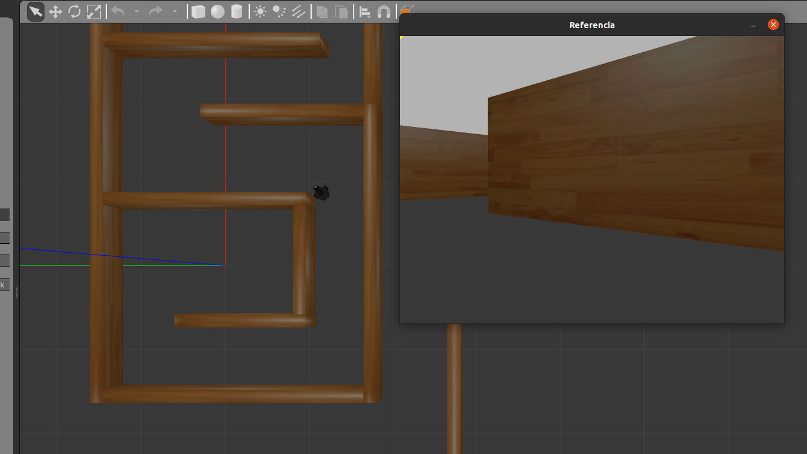

# Robótica Computacional 2022.1

## Avaliação Final (P2)

**Indique seu nome e as questões que escolheu fazer logo abaixo. Você deve escolher 3 questões, senão o avaliador o fará por você.**

Nome:_______________

Questões que fez:____________

**Observações de avaliações nesta disciplina:**

* Clone o repositório da prova dentro de `~/catkin_ws/src` se estiver trabalhando no Linux.
* Você poderá dar quantos `git push` quiser no repositório, apenas o último será considerado.
* Antes de finalizar a prova verifique que os arquivos enviados ao github estão na sua última versão. É sua responsabilidade garantir isso.
* Inicie a prova no Blackboard para a ferramenta de Proctoring iniciar.
* Mantenha o Blackboard e o Proctorio abertos todo o tempo da prova
* Só finalize a prova no Blackboard após enviar a prova via Github classroom.
* Durante esta prova vamos registrar somente a tela e o acesso à web, não a câmera nem microfone
* Ponha o nome no enunciado da prova no Github
* Tenha os repositórios https://github.com/Insper/robot22.1/ ,  https://github.com/arnaldojr/my_simulation e https://github.com/arnaldojr/mybot_description.git  atualizados em seu `catkin_ws/src`.
* Você pode consultar a internet ou qualquer material, mas não pode se comunicar com pessoas ou colegas a respeito da prova
* Todos os códigos fornecidos adicionalmente aos scripts em que as questões serão desenvolvidas foram testados em outro contexto, e são apenas um compilado. Não é obrigatório usar. Fique à vontade para modificar esse código e trazer outros arquivos que achar melhor. 
* Teste sempre seu código
* Entregue código que executa - código com erro que impede de executar implica em zero na questào
* Faça commits e pushes frequentes no seu repositório (tem dicas [no final deste arquivo](./instrucoes_setup.md))
* Permite-se consultar qualquer material online ou próprio. Não se pode compartilhar informações com colegas durante a prova.
* Faça commits frequentes. Em caso de disputa sobre plágio, o primeiro a enviar alguma ideia será considerado autor original.
* A responsabilidade por ter o *setup* funcionando é de cada estudante.
* Todo e qualquer arquivo adicional que for usado deve ser incluído no seu repositório. Não serão consideras repostas que necessitem de instalar bibliotecas adicionais que não se encontram no SSD de Robótica, e nem arquivos que se encontram fora do seu repositório.
* É proibido colaborar ou pedir ajuda a colegas ou qualquer pessoa que conheça os assuntos avaliados nesta prova.
* Os exercícios admitem diversas estratégias de resolução. A prova de cada aluno é única. Atenha-se apenas à rubrica de cada questão.

Existe algumas dicas de referência rápida de setup [instrucoes_setup.md](instrucoes_setup.md)

**Integridade Intelectual**

Se você tiver alguma evidência de fraude cometida nesta prova, [use este serviço de e-mail anônimo](https://www.guerrillamail.com/pt/compose)  para informar ao professor através do e-mail `antoniohps1@insper.edu.br`.

# Questões

## Questão 1  (3.33 pontos)

Nesta questão você irá checar se a mira laser composta por um círculo e um *crosshair* está acertando um alvo se aproximando (avião). A direção do laser é definida pela linha ligando o centro do círculo ao centro do crosshair.

Deve se levar em conta de que o mundo é 3D, e o *crosshair* está à frente do círculo, de forma que a trajetória do laser é uma linha em 3D, com as coordenadas, em pixels, dadas por:

$$ x = (x_c - x_0)/30 * z $$

$$ y = (y_c - y_0)/30 * z $$

onde $z$ é a profundidade (distância do observador), $(x_c, y_c)$ são as coordenadas cartesianas do centro do *crosshair*, em pixels, e $(x_0,y_0)$ são as coordenadas cartesianas do centro do círculo, em pixels.

### O que você deverá fazer

Você precisará encontrar a profundidade do avião com base na sua altura encontrada na imagem e a altura. A altura real do avião é de $H=10m$. A imagem `aeroplane.png` é um exemplo de fotografia tirada quando o avião estava a $D=108,5m$ de profundidade. Corrija eventuais erros da Mobilenet com base na cor da imagem do alvo.

Uma vez conhecida a profundidade, as equações acima devem ser usadas para descobrir as coordenadas $(x,y)$ de impacto do tiro para aquela profundidade. Finalmente basta verificar se essas coordendas se encontram dentro da imagem do avião. 

Caso o laser aerte o avião, escreva "ACERTOU" na tela. 

#### Orientações

Trabalhe no arquivo `./q1/q1.py`. Este exercício **não precisa** de ROS. Portanto pode ser feito até em Mac ou Windows. Antes de tudo rode o arquivo para checar se o video é mostrado. 

#### O que você deve fazer:

|Resultado| Conceito| 
|---|---|
| Não executa | zero |
| Determina a distância focal da câmera virtual, com saída de informação no terminal | **+0.6**|
| Determina o retângulo envolvente do avião na imagem| **+0.6**|
| Identifica a profundidade do avião e escreve na tela | **+0.6**|
| Identifica o centro da circunferência da mira, com saída visual |**+0.6**|
| Identifica o centro do *crosshair*, com saída visual   |**+0.6**|
| Identifica corretamente o ponto na imagem de possível colisão, com saída visual   |**+0.6**|
| Detecta corretamente se o laser acerta a aeronave, com mensagem na tela, mantendo todas as outras saídas visuais | 3.33 |

Casos intermediários ou omissos da rubrica serão decididos pelo professor.

## Questão 2  (2.50 pontos)

Você deve fazer um programa que detecta o vencedor do jogo pedra, papel e tesooura. 

Trata-se de um disputa entre 2 jogadores.

* Jogador1 = mão posicionada a esquerda do video
* Jogador2 = mão posicionada a direita do video

A cada rodada os jogadores escolhem sua jogada entre as opções:

- Pedra
- Papel 
- Tesoura

O resultado de cada rodada pode ser `empate` ou `vencedor` onde:

* Empate: Acontece quando os dois jogadores escolhem a mesma opção de jogada
* Vencedor: Acontece com as seguintes combinações de jogadas:
    - Pedra vence de Tesoura
    - Papel vence de Pedra
    - Tesoura vence de Papel 

### Orientações

Você vai trabalhar no arquivo `q2/q2.py`. com o vídeo `pedra-papel-tesoura.mp4` que já estão no diretório.

### O que você deve fazer:

Fazer o programa que devolve um output visual de acordo com a rubrica. 

### Rubrica

O que é esperado para cada rubrica:

|Resultado| Conceito| 
|----------|--------|
|R0 – Não executa | 0 |
|R1 – Identifica ao menos um jogador e produz saída visual demonstrando | 0,8 |
|R2 – Identifica corretamente os dois jogadores e produz saídas visuais diferentes demonstrando | 1,2 |
|R3 – Identifica ao menos uma jogada dos jogadores e identifica escrevendo no output visual (ex: “JOGADOR `x` = `<PEDRA, PAPEL, TESOURA>`”). | 2 |
|R4 – Identifica corretamente todas as jogadas dos jogadores e identifica escrevendo no output visual | 3 |
|R5 – Compara as jogadas e informa se foi empate ou que jogador que venceu | 3,33 |

Casos intermediários ou omissos da rubrica serão decididos pelo professor.

## Questões de ROS

**Atenção: ** 

Para fazer estas questões você precisa ter o `my_simulation` e o `mybot_description` atualizado.

    cd ~/catkin_ws/src
    cd my_simulation
    git stash
    git pull

Ou então se ainda não tiver:

    cd ~/catkin_ws/src
    git clone https://github.com/arnaldojr/my_simulation.git

Para o mybot_description:

    cd ~/catkin_ws/src
    cd mybot_description
    git stash
    git pull

Ou então se ainda não tiver:

    cd ~/catkin_ws/src
    git clone https://github.com/arnaldojr/mybot_description

Em seguida faça o [catkin_make](./instrucoes_setup.md). 

## Questão 3 (3.33 pontos)

Você deverá fazer o robô dar duas voltas sobre os tracejados brancos do cenário da figura abaixo:

</img>

Para iniciar o cenário do Gazebo execute:

    roslaunch my_simulation quarto.launch

#### O que é para fazer

Faça o robô dar duas volta na pista abaixo, uma volta sobre  tracejado branco mais **externo** e outra volta sobre o tracejado mais **interno**, na ordem e sentido de acordo com a inicial de seu primeiro nome, conforme a tabela abaixo

|Letra inicial do nome| Ordem e sentido| 
|---|---|
| **A até C** | Primeiro pista **externa** no sentido **horário**, depois pista **interna** no sentido **anti-horário** |
| **D até H** | Primeiro pista **externa** no sentido **anti-horário**, depois pista **interna** no sentido **horário** |
| **I até P** |  Primeiro pista **interna** no sentido **anti-horário**, depois pista **externa** no sentido **horário**  |
| **Q até Z** |  Primeiro pista **interna** no sentido **horário**, depois pista **interna** no sentido **anti-horário**  |

</img>
</img>

Dicas:

1. O robô pode identificar quando finalizou a volta através da odometria.  

1. Você pode identificar a pista usando a distância até a parede com o lidar.

1. A direçã odo movimento pode ser reconhecida através da cor da parede à frente.

1. Caso o robô saia da pista tracejada, é permitido retorná-lo manualmente ao centro da mesma no mesmo ponto em que ele saiu até duas vezes.

1. Você pode usar o lidar para evitar que o robô fique preso à parede intena.   

Para responder à questão você deverá trabalhar em `p2_221/scripts/q3.py`.

#### Detalhes de como rodar

O código para este exercício está em: `p2_221/scripts/q3.py`

Para rodar, recomendamos que faça:

    roslaunch my_simulation quarto.launch

Depois:

    rosrun p2_221 q3.py

|Resultado| Conceito| 
|---|---|
| Não executa | 0 |
| Segmenta os tracejados brancas e fornece evidência visual | 0.7 |
| Dá uma volta no caminho, independentemente do sentido  | 1.2 |
| Dá uma volta sobre a pista interna ou externa | 2.0 |
| O robô consegue usar as duas pistas, mas na ordem e/ou sentido errados| 2.8|
| Segue as duas pistas na ordem e sentido corretos | 3.33|

Casos intermediários ou omissos da rubrica serão decididos pelo professor.

## Questão 4 (3.33 pontos)

Seu robô está no labirinto visível abaixo:

    roslaunch my_simulation labirinto_vision.launch

O objetivo do robô é sair do labirinto. Se ele apenas seguir as paredes da esquerda ou da direita com o lidar, deverá ter sucesso na missão. Porém aqui o desafio é usar as técnicas de visão computacional para tal. A demonstração dessas técnicas incrementarão a pontuação alcançada. 

#### O que é para fazer

Faça o robô encontrar a saída usando visã ocomputacional e/ou laser (pode ser uma combinação de ambos). O uso de outros sensores é opcional e não influenciarão na nota. 

#### Detalhes de como rodar

O código para este exercício está em: `p2_221/scripts/q4.py`

Para rodar, recomendamos que faça:

    roslaunch my_simulation labirinto_vision.launch

Depois:

    rosrun p2_221 q4.py

|Resultado| Conceito| 
|---|---|
| Não executa | 0 |
| Faz o robô seguir pardes com  lidar, mas não encontra a saída | 0.5 |
| O robô encontra a saída somente com o lidar | 1.00|
| O robô segue o ponto de fuga quando o mesmo está visível | **+1.00**|
| O robô usa retas verticais para identificar uma abertura do labirinto, e vai em direção a elas | **+0.50**|
| O robô usa visão para detectar a distância e/ou inclinação de paredes e se guia por elas | **+0.50**|
| O robô usa apenas a visão para sair do labirinto, mas sem ponto de fuga quando possível | 2.50 |
| O robô usa apenas a visão para sair do labirinto, seguindo o ponto de fuga quando possível | 3.33 |

Casos intermediários ou omissos da rubrica serão decididos pelo professor.

**Boa sorte!!**